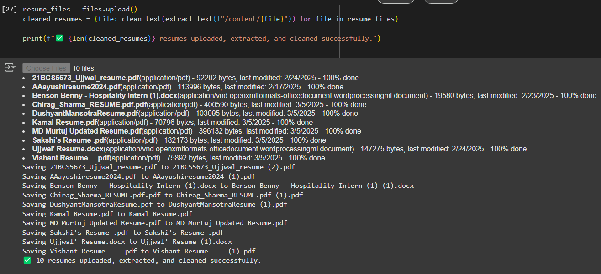
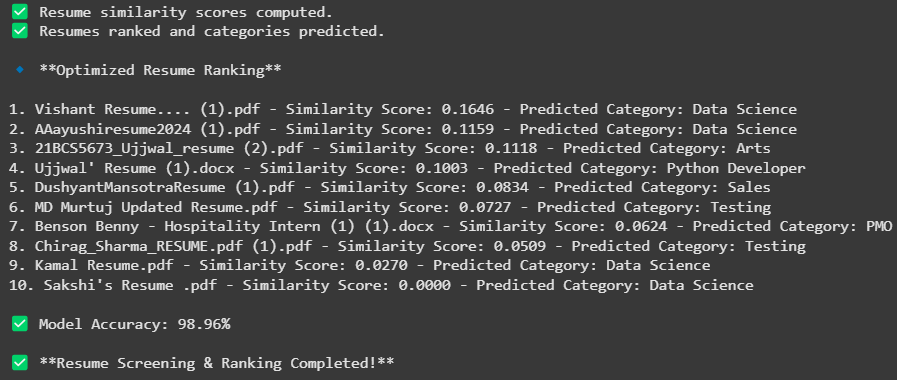
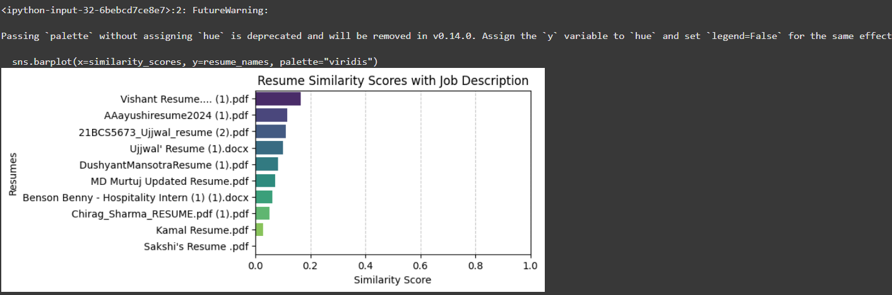
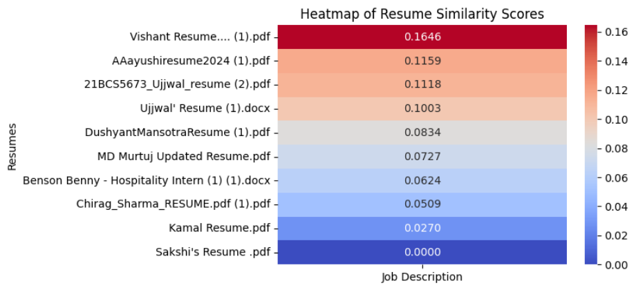

# AI-Powered Resume Screening and Ranking System (P1)

## 🚀 Introduction
With the rapid growth of digital recruitment, manually screening resumes has become inefficient and time-consuming. Our **AI-Powered Resume Screening and Ranking System** automates this process using **Natural Language Processing (NLP)** and **Machine Learning (ML)** to ensure efficient, unbiased, and accurate candidate evaluation.

This project ranks resumes based on **TF-IDF vectorization and cosine similarity**, while a **K-Nearest Neighbors (KNN) classifier** categorizes resumes into relevant job roles. Recruiters receive a ranked list of the most suitable candidates, optimizing hiring decisions.

## 📌 Project Overview
### **🔹 Why this project?**
- **Manual resume screening is slow and biased** – AI minimizes human error and speeds up the process.
- **Keyword-based filtering lacks context** – Our system uses NLP techniques to analyze resumes accurately.
- **Recruiters often miss top candidates** – This tool ensures the best match between **job descriptions and resumes**.

### **🔹 How it Works**
1. **Resume Upload** – Users upload resumes in **PDF/DOCX** format.
2. **Text Extraction & Cleaning** – The system processes and extracts structured data.
3. **Feature Engineering** – Resumes are transformed into numerical vectors using **TF-IDF**.
4. **Ranking Algorithm** – **Cosine Similarity** ranks resumes based on job relevance.
5. **Classification Model** – **KNN Classifier** assigns job roles based on skill-matching.
6. **Results Visualization** – Recruiters receive a **ranked list** and **heatmap visualization** for insights.

## 🌟 Features
✅ **Automated Resume Screening** – No more manual filtering of resumes.  
✅ **AI-Powered Ranking** – Uses NLP & ML for accuracy.  
✅ **Resume Classification** – Predicts the most relevant job role.  
✅ **Heatmap & Data Visualization** – Ensures clear insights.  
✅ **Scalability & Integration** – Can be linked with ATS systems.

---

## 📸 Project Snapshots  

### 1️⃣ Resume Upload  

### 2️⃣ Resume Ranking Results  

### 3️⃣ Bar Plot for Resume Scores  

### 3️⃣ Resume Similarity Heatmap  

---

## 🎥 Demo Video
**Google Drive Link:** *[Add your demo video link here]*

---

## 📂 Source Code & Instruction Manual
🔹 **[View the Source Code](#)** *(Link to be added once uploaded)*  
🔹 **[Instruction Manual](#)** *(To be added later)*

---

💡 *Stay tuned for updates and improvements, including deep learning integration and bias reduction mechanisms!*

### 📧 **For queries, reach out to:**  
📌 **Ujjwal Chadha** – (ujjwalchadha2003@gmail.com) | [GitHub](https://github.com/ujjwalchadha-create)

---
✨ *AI-powered recruitment is the future! This project helps organizations streamline hiring efficiently and fairly.*
